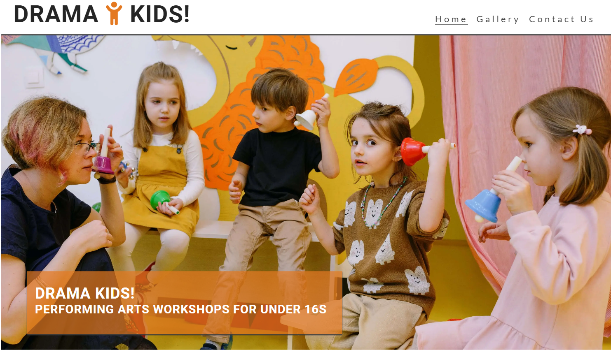
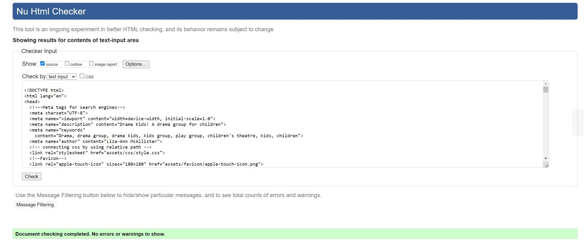
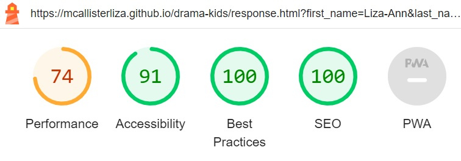

# **DRAMA KIDS!**

The aim of the Drama Kids! website is to provide the visitors with the opportunity to learn about the company ‘Drama Kids!’ and to locate further information such as the company’s ethos, reviews, address and opening times. Visitors of the website can contact the company with ease by either requesting a callback or joining the mailing list to benefit from the perk of a free taster session from the company. 

The site can be accessed via this [link](https://mcallisterliza.github.io/drama-kids/)

---

---
## **User Stories**

### First Time Visitor Goals:

* As a newcomer to the site, my objective is to gain a comprehensive understanding of Drama Kids! and its purpose.
* As a first-time visitor, I aim to navigate the website effortlessly, ensuring quick access to the content I need.
* As a first-time visitor, I wish to read reviews of this children's club, evaluating their validity and trustworthiness.

### Returning Visitor Goals:
* As someone revisiting the site, I seek to browse images of children's activities to gauge whether my child would enjoy joining.
* As a returning visitor, my goal is to delve into the group's ethos to assess its suitability for my child.
* As a returning visitor, I intend to locate the contact page for reaching out to the group and obtaining more information so it is more comfortable for me.
* As a returning visitor, I want to find community links, so that I can learn more about the company and get involved on their social media groups and chats.

### Frequent Visitor Goals:
* As a frequent visitor, I want to check whether there are any new reviews so I can see what like-minded people are saying about the company.
* As a frequent visitor, I want to have the option of different reasons to contact the company and choose whether I am recontacted via mobile or mailing list.
* As a frequent visitor, I want the option to be able to sign up for a free taster session where my child can engage with the company and decide whether we wish to enroll.

## Features

### Navbar

+ ##### Navigation
    - The nav bar is located at the top of the page.
    - Within the nav bar, there is the Drama Kids! logo for the company. The company logo is also responsive. When the user hovers over the Drama Kids! logo the letters change to different colors.
    - The nav bar also contains three links on the right-hand side:
        * HOME - This leads the user to the Home page where they can navigate through the company's 'About Us' section, the address and opening times, reviews from clients and a footer with links to the company's social media pages.
        * GALLERY - This leads the user to the gallery where the user can view images of different Drama Kids! members participating in performing arts workshops.
        * CONTACT US - This leads the user to the contact page where they can contact the company and request whether to join the mailing list or request a callback for further information.
    - The above links have an animated hover effect which underlines the words with orange to keep in with the page's color scheme.
      
    - The navigation is clear and concise and is easy for the user to use:
 
      

      - **The navigation bar is responsive on smaller screens such as mobile devices:**
    
          
          - The navigation bar has the Drama Kids! logo on the left and a hamburger menu on the right side:
            
              
          
        
          - When the user clicks the hamburger bar there is a dropdown menu with the different links to home, gallery and contact us:
            

           

      **Rainbow Surprise**

      The h1 element/logo has a feature added to it that is not obvious to the user when they first view the page. If the user hovers the cursor over the h1/logo the letters d, r, a, m, a, k, i, d, s and ! change to different colors respectively. This is a 'hidden gem' on the page for playfulness. It gives the page a sense of playfulness and positivity which is what a child's drama group should reflect.

      
      
      

---

### Home Page

* Immediately displays a short cover text to quickly inform the user that Drama Kids! runs performing arts workshops for children under 16 years old.
* Contains an 'About Us' section which presents the main idea of the company and its ethos.
* Displays address and workshop times.
* Presents feedback from satisfied clients of the company.
* Displays a call to action button which invites the user to fill in the contact form and directs the user to the 'Contact Us' page.

  

---

#### Hero Section

* The hero section has a nonfixed background image of a children's drama group.

* The hero section contains cover text which overlays the hero image. This text briefly outlines that Drama Kids! is a drama group that facilitates performing arts workshops for children under 16 years of age.

---

#### 'About Us' and 'Times & Location' sections:

* The 'About Us' section informs the user what the company is about and explores the company's ethos and passion for engaging children in performing arts whilst in a safe environment.
  
* The Times & Location' section clearly defines the days and times of the sessions along with the full address of Drama Kids!

---

#### 'Our Top Reviews' section

* The reviews section has four reviews from people who were satisfied with the service their child experienced with the company.
  
* Each review has an image of the person who has left the review.
  
* Icons have been used to enclose the speech from each person.
  
* Each review has the name of the person leaving the review.

---

#### Call to action section:

* The call to action button has a clear message for users to contact the company and also offers the user the opportunity to benefit from a free taster session when filling in the contact form.
  
* When clicked the call to action button directs the user to the 'Contact Us' page where they are invited to fill out the form.
  
* The call to action button is also responsive and changes color to orange.

 

---

#### Footer

* The footer contains icons of the social media pages used by the company.

* The icons react by changing color to orange when hovered over and when clicked the user is directed to the social media page in a new window.

---

### Gallery Page

* The gallery page has the same nav bar as the homepage.

* The gallery page has photos of the members of Drama Kids! participating in performing arts workshops.
  
* The images are responsive and the images adjust to the size of the user's screen.
  
* Each image is also responsive when hovered over. The image's background changes color.
  
* At the bottom of the page, there is another call to action button which is the same as the button on the home page and has the same responsiveness.
  
* The footer is also identical to the footer on the home page with the same responsiveness.

---

### Contact Us page

* The contact page has a form for the user to fill in.
  
* All text input fields are 'required' to fill out except for the telephone number field as a 'required' telephone number field can be offputting for users.
  
* The form also has checkboxes for the visitors to select their choices between:
      - 'Join our mailing list and claim a free taster session'
      - 'Request a call back for further information'

* The submit button is responsive when the user hovers over it and it changes color to orange and directs the user to the response page.
  
* The contact page is responsive and adapts to different screen sizes.

 

---

### Response page

* The user is directed to the response page when the user clicks the submit button on the form on the contact page (when all required fields are filled in).
  
* The response page contains a brief thank you message to the user and informs the user that the company will contact the user within 24 to 72 hours.
  
* After ten seconds on the contact page, the page will automatically direct the user to the home page.
  

---

## Technologies Used

- [HTML](https://developer.mozilla.org/en-US/docs/Web/HTML) was used to build the structure of the website.
- [CSS](https://developer.mozilla.org/en-US/docs/Web/css) - was used to add style to the HTML to give the website its style.
- [CSS Flexbox](https://developer.mozilla.org/en-US/docs/Learn/CSS/CSS_layout/Flexbox) - was used to arrange items on the webpage.
- [VSCode](https://code.visualstudio.com/) was used to write and edit the code.
- [Git](https://git-scm.com/) was used for the version control of the website.
- [GitHub](https://github.com/) was used to host the code of the website.

---

## Design

### Color Scheme

* #FFFFFF White was used as the main color of the website to give it a simplistic and clean look. White conveys a sense of freedom and it gives the user the visual breathing space to absorb the information presented on the screen.
  
* #252525 Very dark gray was used for text, separation of content and the footer. This worked well to contrast with the white background. It created a website that was accessible to read.
  
* #e47921 A deep shade of orange was used for the logo, cover text overlay and for all the responsive buttons and social media icons when hovered over and the background on the images in the gallery when hovered over. Orange is a warm and welcoming color for the user. Orange gives a sense of warmth and compassion which will create a sense of a soothing and safe environment whilst on the page reassuring parents that this is a safe drama club to send their child to. Psychologically, in business applications orange gives the impression of affordability which will also attract the user as the visitors of this website will already undoubtedly be budgeting their finances for different recreational activities for their child.

### Typography

* Lato Google Font was used as the main font of the website as it ensured that the website was readable and accessible.

- Roboto Google Font was used for the main logo and headings to attract the user's attention whilst also being accessible to read.

---

## Testing

## Validator testing
+ ### HTML
  #### Home Page
    - No errors or warnings were found when passing through the official W3C validator.
      

  #### Gallery Page
    - No errors or warnings were found when passing through the official W3C validator.
      

    

  #### Contact Page
    - No errors or warnings were found when passing through the official W3C validator.
    

    

  #### Response Page
    - No errors or warnings were found when passing through the official W3C validator.
    

+ ### CSS
  - No errors or warnings were found when passing through the official W3C validator.
    

+ ## Lighthouse report

    - Using lighthouse in devtools I confirmed that the website is performing well, accessible and the colors and fonts chosen are readable.
    
  ### Home page
    

  
  ### Gallery page
   

  
  ### Contact page
    

  ### Response page
  

### Note: 
 I have compressed my images for my page numerous times. Unfortunately, I cannot compress these images any further as the quality was starting to become quite poor. This has had an impact on my performance score.

  ---

## Manual testing

| feature | action | expected result | tested | passed | comments |
| --- | --- | --- | --- | --- | --- |
| Navbar | | | | | |
| Home | Click on the "Home" link | The user is redirected to the main page | Yes | Yes | - |
| Gallery | Click on the "Gallery" link | The user is redirected to the gallery page | Yes | Yes | - |
| Contact Us | Click on the "Contact Us" link | The user is redirected to the 'Contact Us page | Yes | Yes | - |
| Footer | | | | | |
| Facebook icon in the footer | Click on the Facebook icon | The user is redirected to the Facebook page | Yes | Yes | - |
| Twitter icon in the footer | Click on the Twitter icon | The user is redirected to the Twitter page | Yes | Yes | - |
| YouTube icon in the footer | Click on the YouTube icon | The user is redirected to the YouTube page | Yes | Yes | - |
| Instagram icon in the footer | Click on the Instagram icon | The user is redirected to the Instagram page | Yes | Yes | - |
| Tik Tok icon in the footer | Click on the Tik Tok icon | The user is redirected to the Tik Tok page | Yes | Yes | - |
| Home page | | | | | |
| Call to action button above footer | Click on the call to action button | The user is redirected to the 'Contact Us' page | Yes | Yes | - |
| Gallery page | | | | | |
| Images in the gallery | User hover the image | Image's background color changes to orange | Yes | Yes | - |
| Call to action button above footer | Click on the call to action button | The user is redirected to the 'Contact Us' page | Yes | Yes | - |
| Contact page | | | | | |
| First name input | Enter the first name | The first name is entered | Yes | Yes | If user doesn't enter the first name, the error message appears |
| Last name input | Enter the last name | The last name is entered | Yes | Yes | If user doesn't enter the last name, the error message appears |
| Telephone input | Enter the telephone number | The telephone number is entered | Yes | Yes | Note: this is not a required field |
| Email input | Enter the email | The email is entered | Yes | Yes | If user doesn't enter the email, the error message appears. If user enters not valid email, the error message appears |
| Join mailing list checkbox | Click on the checkbox | The checkbox is checked | Yes | Yes | These checkboxes are not required as the user can choose not to join mail list or request callback and other reasons for contacting |
| Request callback | Click on the checkbox | The checkbox is checked | Yes | Yes | These checkboxes are not required as the user can choose not to join mail list or request callback and other reasons for contacting |
| "Submit" button | Click on the "Submit" button | The user is redirected to the response page | Yes | Yes | - |
| Response page | | | | | |
| Response message | The user will be automatically redirected to the home page after 12 seconds | The user is redirected to the home page | Yes | Yes | - |

---

### Responsiveness
- The website was checked with the responsive viewer in Chrome to assess responsiveness on different screen sizes.
 

### Compatibility
- To confirm the correct functionality, responsiveness, and appearance the website was tested successfully on Chrome, Firefox and Microsoft Edge.

### Fixed Bugs

- When I deployed my project to Github pages I realized that my website was not working correctly as the four images from my reviews section were showing as broken links. After some investigation, I realized that I had used incorrect file paths in my code. In my code was: "/assets/images/pic2.png". After revisiting the lesson on file paths I realized I needed to remove the first slash from this code for my images to work. Once I removed this slash my images were working.
  
- When I ran Lighthouse on my project I had an error message for my call to action button for accessibility. After reading the guidance from Lighthouse and re-examining my code I realized that my aria label did not match the text shown to the user on the button. I corrected this error and ran Lighthouse again and gained 100% for accessibility.
  
- When I deployed my project to Github I realized that my hero image did not scroll with the rest of the homepage content. I revisited my CSS code and realized that I had positioned my hero image as 'fixed'. I corrected this and when I viewed my live project again my hero image scrolled as originally planned.
  
- When I ran my HTML code through the HTML validator I received error messages for unexpected slashes in self-closing tags. I revisited my code and used the HTML error message as guidance. I then went to the referenced line of code and found the error. I corrected this by removing the slash. I then ran my HTML through the validator once more and the result came back with no error messages.
  
- When I ran Lighthouse on my project my performance score was extremely low and this was due to the large images I have in my project. I spent a lot of time compressing each image over and over again. I added my new compressed images and ran Lighthouse again. My performance score greatly improved however it still stated that my images were too big. I once again attempted to compress the images further but unfortunately, I could not compress the images any further without resulting in very poor image quality. Therefore I kept the images as they were. My performance score has greatly improved since I compressed my images but I am unable to compress them any further.

### Unfixed Bugs

- On screen sizes similar to tablets I have found that my footer has 2 white lines running horizontally through the black footer. Before submitting this project I did not have time to investigate and fix this bug. I will however revisit this at a later date to find out how to correct this error for my learning.

## Deployment

### Deployment to GitHub Pages

- This site was deployed to GitHub pages. The steps I took to deploy this project:
- In the [GitHub Repository](https://github.com/mcallisterliza/drama-kids) go to 'Settings Tab'. From the source section, I selected the 'Main Branch' and then click save. The page then refreshes and indicates the deployment was successful. Access the live link [here](https://github.com/mcallisterliza/drama-kids)
  

### Local deployment

To make a local copy of this project, clone it.
In your IDE Terminal, type the following command to clone my repository:

- git clone `https://github.com/mcallisterliza/drama-kids.git`

---

## Future improvements

- I would like to improve the quality of my 'commit' messages. I am aware at times that some of my commit messages may not be very clear and this is something I look forward to improving in my future projects.
  
- I would like to have put more content onto my gallery page such as interactive 'figure-captions' so when the user hovered over the images, styled 'figure-captions' appeared and gave the user more information about the benefits of the activities that the children were participating in. An example of this would be when the image of the children playing mime games was hovered over, a styled 'figure-caption' would appear as an overlay of the image may note: "Mime is a fun and creative form of imaginative play which allows the participant to develop their communication skills without the use of speech".
  
- I would like to have put an interactive map on the 'Contact Us' page where the user could clearly see the location of Drama Kids! on the map and zoom in and out of the location to plan their journey to the sessions.

---

## Credits

- [Font](https://fonts.google.com/) Fonts taken from Google Fonts

- [Icons](https://fontawesome.com/icons) Icons were taken from Font Awesome.

- [Tiny 'png' - Image Compressor](https://tinypng.com/) Used to compress images.

- [Compressor - Image Compressor](https://compressor.io/) Used to compress images.

- [Coolors](https://coolors.co/) Color scheme image generated from 'Coolors'

- [GitHub](https://github.com/) was used to deploy the website.

- [VSCode](https://code.visualstudio.com/) was used to edit the code for the website.

- [Pexels](https://www.pexels.com/) was used for media as seen below.

- [The Code Institute](https://github.com/Code-Institute-Org) Inspiration for my navigation bar and hero image came from the Love Running project I undertook with The Code Institute.

## Media
All images were taken from [Pexels](https://www.pexels.com/)
- [Hero image](https://www.pexels.com/photo/children-with-her-students-holding-different-color-bells-8535230/)
- [1st review image](https://www.pexels.com/photo/woman-in-collared-shirt-774909/)
- [2nd review image](https://www.pexels.com/photo/man-wearing-eyeglasses-769772/)
- [3rd review image](https://www.pexels.com/photo/man-smiling-behind-wall-220453/)
- [4th review image](https://www.pexels.com/photo/photography-of-a-guy-wearing-green-shirt-1222271/)
- [1st gallery image](https://www.pexels.com/photo/kids-pointing-their-fingers-on-a-placard-8087866/)
- [2nd gallery image](https://www.pexels.com/photo/group-of-children-sitting-on-white-chair-8422141/)
- [3rd gallery image](https://www.pexels.com/photo/people-sitting-on-chairs-inside-the-room-8364026/)
- [4th gallery image](https://www.pexels.com/photo/a-teacher-speaking-surrounded-by-his-students-8364065/)
- [5th gallery image](https://www.pexels.com/photo/group-of-children-sitting-on-white-chairs-8422135/)
- [6th gallery image](https://www.pexels.com/photo/happy-active-diverse-girl-jumping-and-having-fun-5063072/)
- [7th gallery image](https://www.pexels.com/photo/group-of-children-sitting-on-classroom-chairs-8422133/)
- [8th gallery image](https://www.pexels.com/photo/a-girl-sitting-lonely-by-herself-in-the-classroom-6936340/)
- [9th gallery image](https://www.pexels.com/photo/group-of-kids-playing-together-8033865/)
- [10th gallery image](https://www.pexels.com/photo/children-playing-with-a-colorful-parachute-8384294/)
- [11th gallery image](https://www.pexels.com/photo/active-children-doing-balancing-exercises-8613312/)
- [12th gallery image](https://www.pexels.com/photo/group-of-children-playing-on-green-grass-8613319/)
- [13th gallery image](https://www.pexels.com/photo/preschool-children-doing-hand-exercise-with-teachers-8613366/)
- [Contact & response page background image](https://www.pexels.com/photo/group-of-children-sitting-on-white-chairs-8422135/)

## Acknowledgments

- [Code Institute](https://codeinstitute.net/) Thank you to the fantastic Slack community members and friends I have made during this project for their support, chats and help.
  
- [Iuliias Konovalova](https://github.com/IuliiaKonovalova) Thank you to my mentor has given me great advice, constructive feedback and an overall sense of confidence and calmness whilst I have embarked on my new learning journey.
  
- [Kevin Powell](https://www.youtube.com/user/KepowOb) for his accessible and informative online tutorials.

- [GitHub](https://github.com/) Thank you to GitHub for providing a free space for me to deploy my website.

- [VSCode](https://code.visualstudio.com/) Thank you to VS Code for providing a free space for me to build and edit my code.

- Thank you to my wonderful family because without them I would not have been able to do this.

